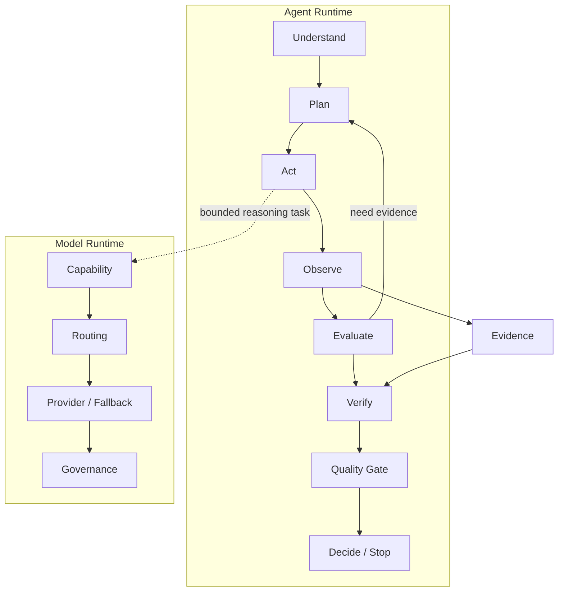

# AI Native QA Agents

[简体中文](README.zh-CN.md) · [Engineering documentation](docs/README.md)

An open, evidence-driven reference architecture for building AI-native software quality agents across the delivery lifecycle.

The project treats an agent as a controlled runtime, rather than an unbounded model loop. Deterministic checks collect and normalize evidence; models are called only for bounded reasoning tasks; verification and quality gates determine whether a result can support a decision.



## Principles

- Evidence over opinion.
- Verification over generation.
- Deterministic analysis before model reasoning.
- Explicit budgets, permissions, provenance, and termination.
- Language, framework, and model-provider neutrality.

## Roadmap

| Release | Controlled capability |
| --- | --- |
| v0.1 | Minimal controlled review loop |
| v0.2 | Stateful re-plan and context expansion |
| v0.3 | Test generation, execution, repair, and retry |
| v0.4 | Mutation and effectiveness loop |
| v0.5 | Hypothesis, challenge, and refinement loop |
| v0.6 | Pull-request and baseline aggregation |
| v0.7 | Policy-aware release decisions |
| v0.8 | Production feedback loop |
| v0.9 | Verified knowledge persistence |
| v1.0 | Stable generic agent runtime |

Read the full [roadmap](ROADMAP_AND_VERSION_DESIGN.md) and choose a release pack in [the documentation index](docs/README.md).

## Repository layout

```text
.
├── packages/       # Python runtime packages
├── adapters/       # Language, test-framework, and model adapters
├── rules/          # Deterministic quality rules
├── evals/          # Golden and adversarial evaluation data
├── integrations/   # CI and SCM integrations
├── examples/       # Runnable reference repositories
├── tests/          # Automated tests for the implementation
├── docs/           # Versioned engineering packs, v0.1 through v1.0
└── *_SPEC.md       # Cross-version runtime contracts
```

v0.1 implements an evidence-driven test-quality review baseline for Python/pytest and TypeScript/Playwright repositories. Start with its [engineering pack](docs/v0.1-engineering/README.md).

## v0.1 quick start

```bash
python -m pip install .
qa-agent detect .
qa-agent review .
qa-agent review . --format sarif > qa-agent.sarif
qa-agent config show
```

The initial implementation runs a bounded deterministic loop (`detect → inspect diff → discover tests → run rules → verify and gate`). It exposes all fifteen v0.1 static quality signals, attaches SHA-256-backed evidence to deterministic findings, supports YAML/JSON configuration, and fails only on critical severity by default. Semantic model review remains disabled by default and is enabled only through an injected provider and positive model budget.

## Key documents

- [Project blueprint](PROJECT_BLUEPRINT.md)
- [Agent Runtime specification](AGENT_RUNTIME_SPEC.md)
- [Model Runtime specification](MODEL_RUNTIME_SPEC.md)
- [Master implementation roadmap](MASTER_IMPLEMENTATION_ROADMAP.md)
- [Full engineering plan](FULL_ENGINEERING_PLAN.md)
- [Project contribution rules](AGENTS.md)

## Status

This repository includes an executable v0.1 baseline and versioned engineering packs for subsequent releases. The v0.1 baseline is not yet a production release.
