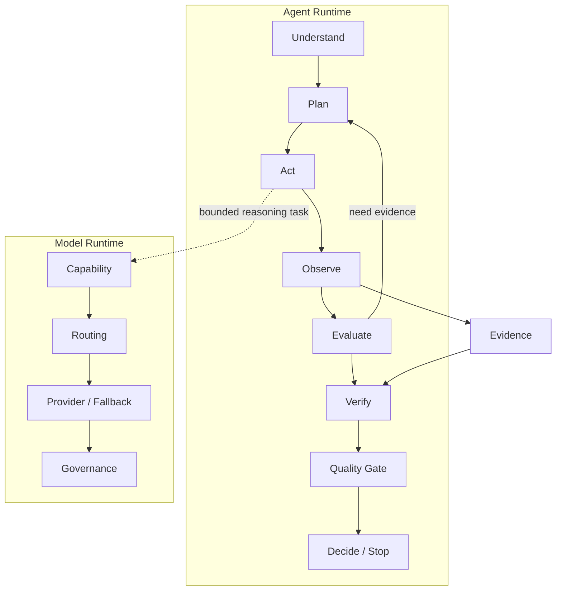

# AI Native QA Agents

[简体中文](README.zh-CN.md) · [Engineering documentation](docs/README.md)

A public, evidence-driven reference architecture for building AI-native software quality agents across the delivery lifecycle.

The project treats an agent as a controlled runtime, rather than an unbounded model loop. Deterministic checks collect and normalize evidence; models are called only for bounded reasoning tasks; verification and quality gates determine whether a result can support a decision.



## Principles

- Evidence over opinion.
- Verification over generation.
- Deterministic analysis before model reasoning.
- Explicit budgets, permissions, provenance, and termination.
- Language, framework, and model-provider neutrality.

## Roadmap

| Release | Controlled capability |
| --- | --- |
| v0.1 | Minimal controlled review loop |
| v0.2 | Stateful re-plan and context expansion |
| v0.3 | Test generation, execution, repair, and retry |
| v0.4 | Mutation and effectiveness loop |
| v0.5 | Hypothesis, challenge, and refinement loop |
| v0.6 | Pull-request and baseline aggregation |
| v0.7 | Policy-aware release decisions |
| v0.8 | Production feedback loop |
| v0.9 | Verified knowledge persistence |
| v1.0 | Stable generic agent runtime |

Read the full [roadmap](ROADMAP_AND_VERSION_DESIGN.md) and choose a release pack in [the documentation index](docs/README.md).

## Repository layout

```text
.
├── packages/       # Python runtime packages
├── adapters/       # Language, test-framework, and model adapters
├── rules/          # Deterministic quality rules
├── evals/          # Golden and adversarial evaluation data
├── integrations/   # CI and SCM integrations
├── examples/       # Runnable reference repositories
├── tests/          # Automated tests for the implementation
├── docs/           # Versioned engineering packs, v0.1 through v1.0
└── *_SPEC.md       # Cross-version runtime contracts
```

Current package version is **0.3.1**. Executable baselines cover v0.1 review, v0.2 requirement intelligence, and v0.3 test engineering. Later packs remain design-first until implemented.

## Quick start

```bash
python -m pip install .
qa-agent detect .
qa-agent review .
qa-agent review . --format sarif > qa-agent.sarif
qa-agent config show
```

### v0.1 review

Bounded deterministic loop: `detect → inspect diff → discover tests → run rules → verify and gate`. Fifteen static quality signals, SHA-256-backed evidence, YAML/JSON configuration, critical-by-default gate. Semantic model review stays disabled unless an injected provider and positive model budget are present.

### v0.2 requirement intelligence

```bash
qa-agent analyze-requirement path/to/req.md --trace-db ./trace.db
qa-agent map-coverage --requirement REQ-ID --repository . --trace-db ./trace.db
qa-agent review-pr . --requirement REQ-ID --trace-db ./trace.db
qa-agent eval --version v0.2
```

Requires an explicit `--trace-db`. Missing evidence terminates as `INSUFFICIENT_EVIDENCE`.

### v0.3 test engineering

```bash
qa-agent engineer-test \
  --requirement REQ-ID \
  --repository . \
  --trace-db ./trace.db \
  --generator-file ./candidate.json
qa-agent eval --version v0.3
```

Default execution copies the repository into a local temporary worktree, applies test-only patches, and runs pytest there without writing the original tree. Optional hardened isolation: `--execution-backend docker` (requires a local Docker image). Playwright remains detect-only when binaries are unavailable. Patches are never auto-applied or committed.

## Key documents

- [Project blueprint](PROJECT_BLUEPRINT.md)
- [Agent Runtime specification](AGENT_RUNTIME_SPEC.md)
- [Model Runtime specification](MODEL_RUNTIME_SPEC.md)
- [Master implementation roadmap](MASTER_IMPLEMENTATION_ROADMAP.md)
- [Full engineering plan](FULL_ENGINEERING_PLAN.md)
- [Project contribution rules](AGENTS.md)
- [Changelog](CHANGELOG.md)

## Status

This repository includes executable baselines through v0.3.1. It is not yet a production release.

## License

This project is licensed under the [PolyForm Noncommercial License 1.0.0](LICENSE). See the license for permitted uses and conditions.
